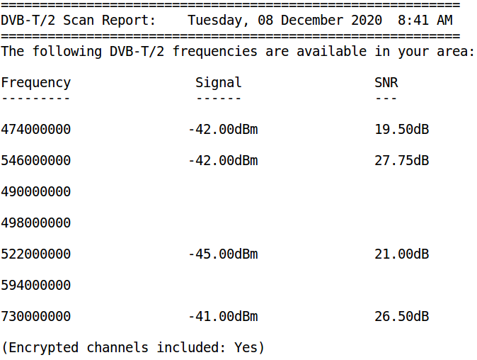

dvbt-scan
---------
A tool to scan DVB-T/2 frequencies for use with 
open source programs like mplayer, vlc, xine, VDR. 

This script will blindly scan for Free-to-Air Digital TV 
broadcasts in your area. Also use it to generate initial 
tuning data used by DVB utilities such as dvbv5-scan, 
dvbv5-zap

NOTE: For this script to work, you need to first install 
the w_scan utility i.e. In Fedora/Red Hat:  yum -vy install w_scan

